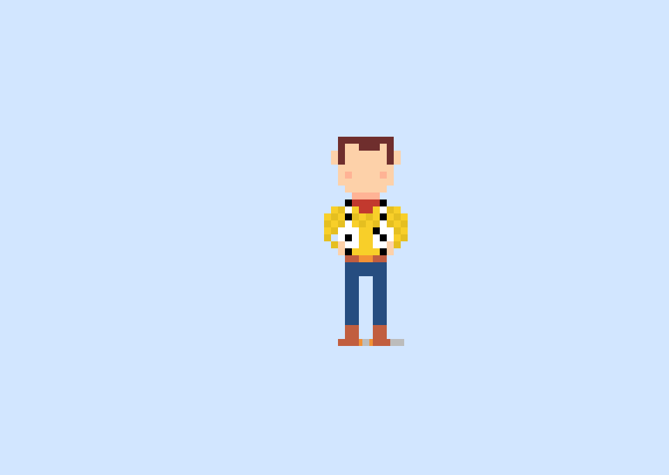
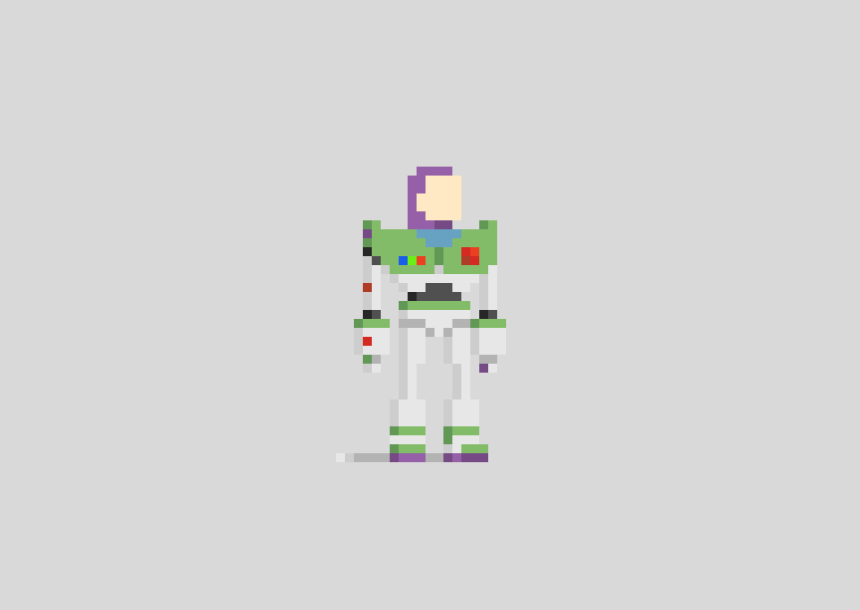
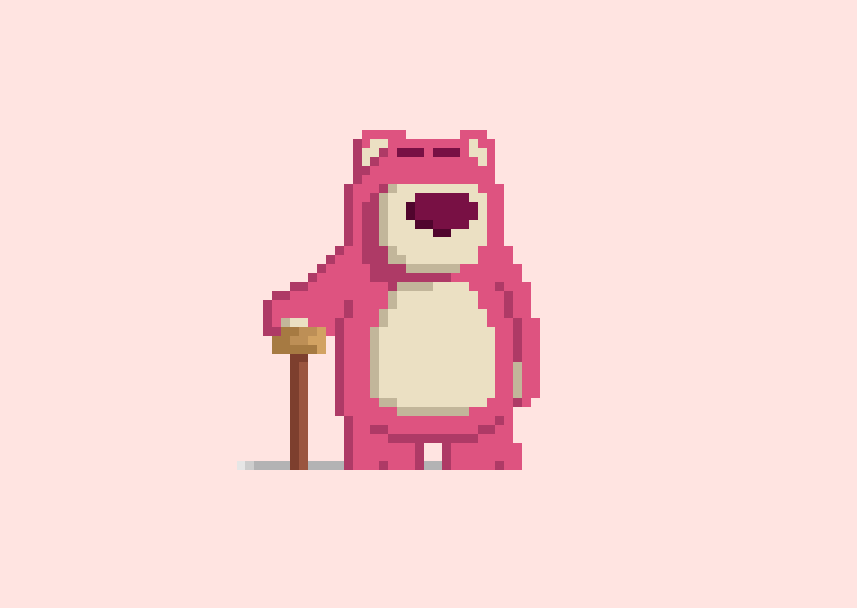
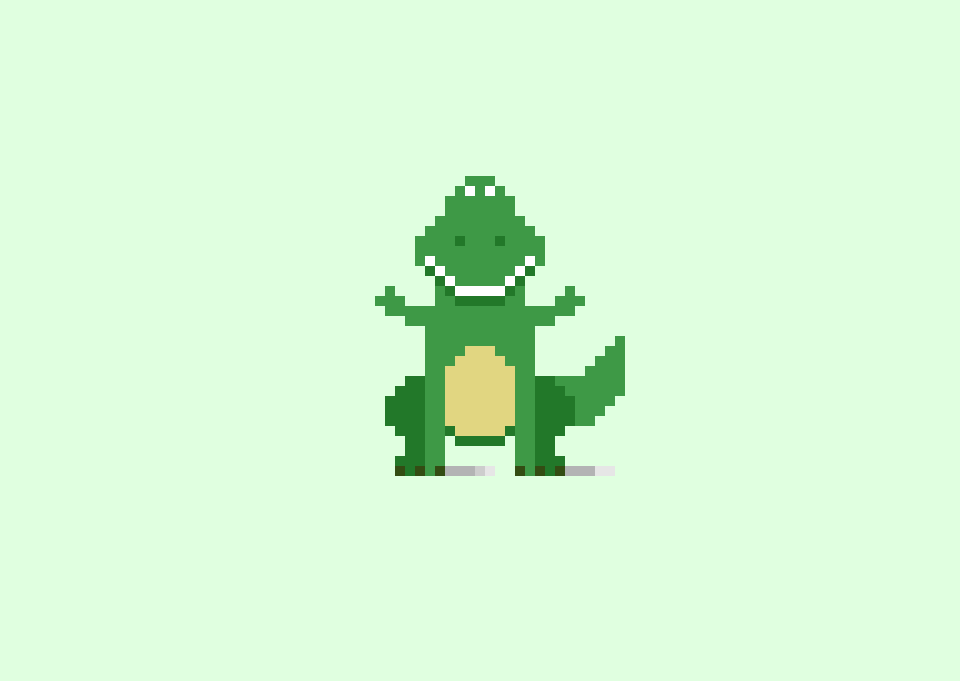

# ©️ Toy Story Characters - Pixel Art

Drawing Pixel Art Toy Story Characters with HTML and CSS 💛

## Woody

  

## Buzz Lightyear

  

## Lotso

  

## Rex

  

## 👩 Author

| [ <b>@laisfrigerio</b>](https://github.com/laisfrigerio)  |
| :---: |

## 📄 License

This project is licensed under the MIT License - see the LICENSE.md file for details